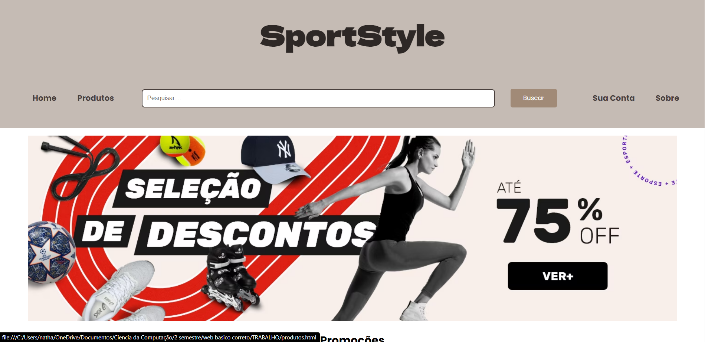

# TRABALHO (SportStyle)

<b>Primeira etapa:</b>

Tema: SportStyle (loja esportiva) 
Paginas: 
1 - Página Principal 
2 - Produtos 
3 - Login 
4 - Cadastro 
5 - Sobre 
6 - Adm 

Trabalho realizado para a disciplina de WebBásico da Universade Positivo curso de Ciência da Computação
 
Paulo Haliski: https://github.com/haliskipaulo  

<b>Segunda etapa:</b>

Aplicação de JavaScript no trabalho realizado anteriormente.

